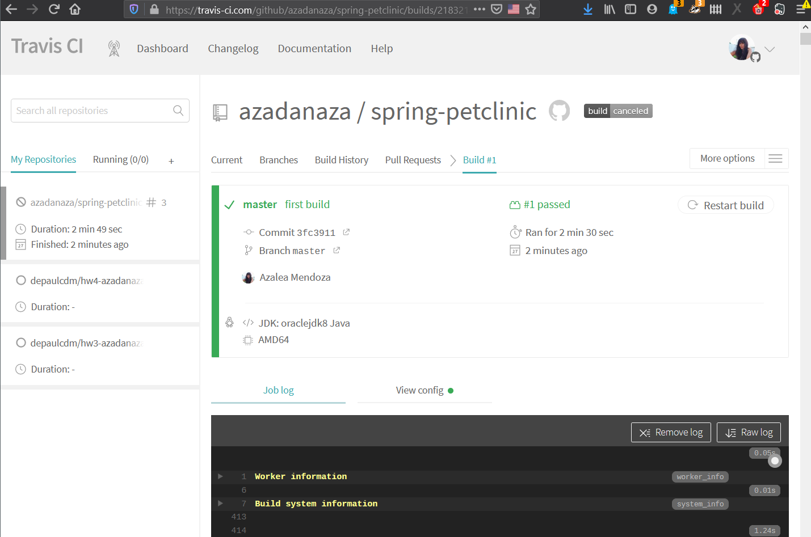
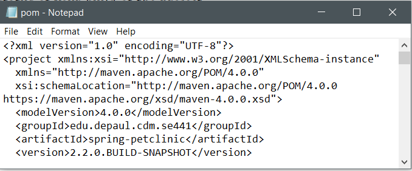
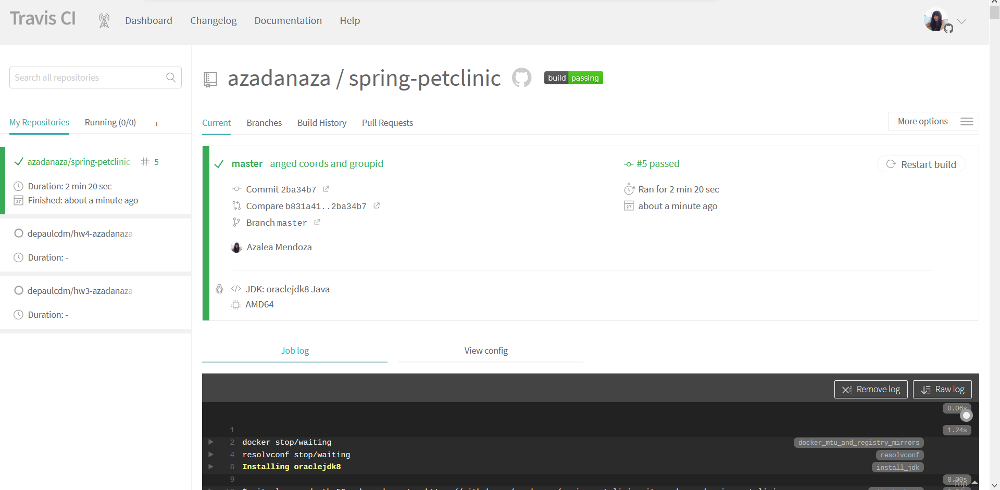
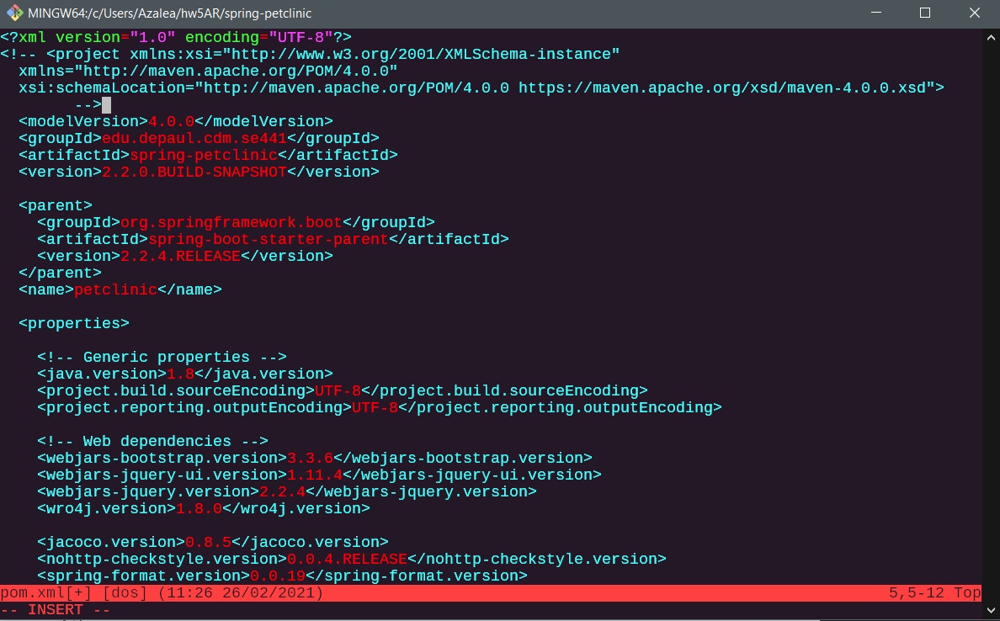

Azalea Rudolph 1828019

5 pts   Your Github account showing that is has been forked from thedepaulcdm/spring-petclinicrepository.

5 pts   Your Travis CI dashboard showing a successful first build.

5 pts   The section of the POM file showing the coordinates after you’ve changed them.

5 pts   Your Travis CI dashboard showing a successful build after your change of the groupID.

5 pts   The section of the POM file showing the coordinates after you’ve commented themout.

5 pts   Your Travis CI dashboard showing the unsuccessful build after the breaking change.

5 pts   Your Github repository with thereadme.mdfile selected showing the build failedstatus after the Travis CI build fails.

5 pts   The section of the POM file showing the coordinates after you’ve fixed them.

5 pts   Your Travis CI dashboard showing the successful build after the breaking change hasbeen fixed.

5 pts   Your Github repository with thereadme.mdfile selected showing the build successstatus after the Travis CI build has recovered

